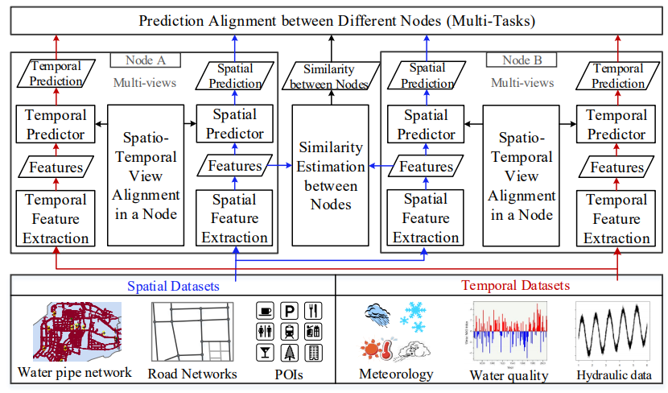

# stMTMVL
Multi-task multi-view learning for urban water quality prediction based on spatio-temporal dataset

*This is an easy implement of stMTMVL using Matlab, tested on Win 10.*

## Requirements

stMTMVL uses the following dependencies: 

* [Matlab] and its dependencies
* windows 8 and latest version


## Paper
Ye Liu, Yu Zheng, Yuxuan Liang, Shuming Liu and David S. Rosenblum. "[	
Urban Water Quality Prediction Based on Multi-task Multi-view Learning.](https://www.microsoft.com/en-us/research/wp-content/uploads/2016/06/ijcai16-Zheng-water-quality.pdf)", IJCAI 2016.

If you find our code and dataset useful for your research, please cite our paper:
```
@inproceedings{liu2016urban,
  title={Urban water quality prediction based on multi-task multi-view learning},
  author={Liu, Ye and Zheng, Yu and Liang, Yuxuan and Liu, Shuming and Rosenblum, David S},
  booktitle={Proceedings of the Twenty-Fifth International Joint Conference on Artificial Intelligence},
  pages={2576--2582},
  year={2016},
  organization={AAAI Press}
}
```
## Framework


## Guide
Please refer to "How to use.pdf" under the root folder.


